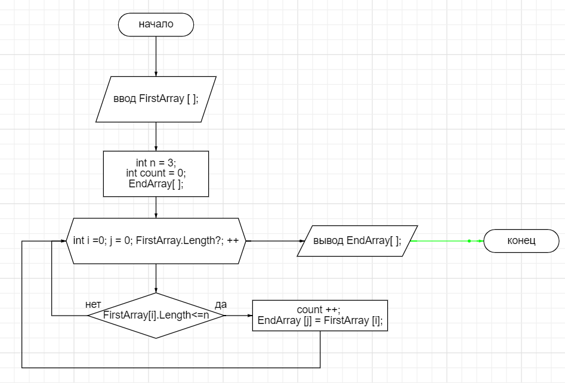

# Задача:
Написать программу, которая из имеющегося массива строк формирует новый массив из строк, длина которых меньше, либо равна 3 символам. Первоначальный массив можно ввести с клавиатуры, либо задать на старте выполнения алгоритма. При решении не рекомендуется пользоваться коллекциями, лучше обойтись исключительно массивами.

***

## Решение:

1. Вводим элементы первоначального массива.
2. Осуществляем перебор элементов из первоначального массива
3. Проверяем каждый элемент массива на соответствие условию: - длина строки меньше или равна заданному значению (трем):
- если строка удовлетворяет условию, то прибавляем счетчик длины нового массива и присваиваем значение этого элемента элементу нового массива;
- иначе переходим к следующему элементу первоначального массива.
4. Возвращаем новый заполненый массив.
5. Осуществляем печать исходного и конечного массива.

****************
## Блок-схема

